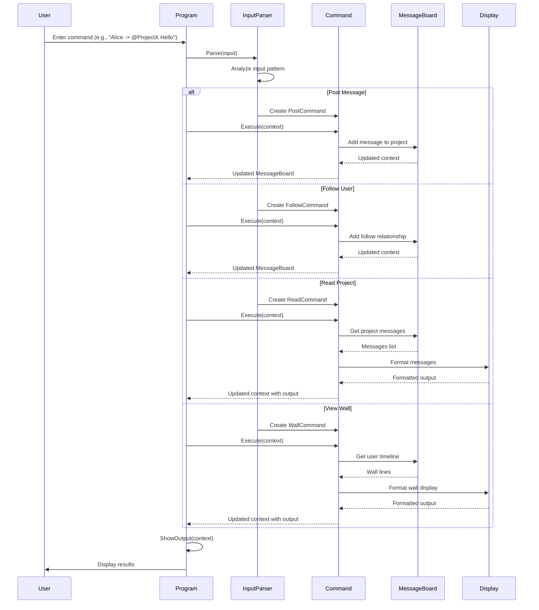

# inlogik submission

## Warning

This has been built using .NET 8.0 rather than the required .NET 6.0.  There isn't a supported version of .NET available for Ubuntu linux (apparently) and I didn't want to burn too much time in hunting and/or compiling one from scratch.

## Approach

(Almost) everything has been built using TDD (check repo history for evidence).  Starting from the commands and working my way out.

Because of the TDD approach, there is a lot of stateless code to support easier test setup.

Exception: The main input handling loop in `Program.cs` has only been manually tested.

## Architecture Flow

## TODO

There is still a lot of work to be done around `Program.cs` and the main datastructures behind `MessageBoard.cs`.

The approach is to construct the `MessageBoard` instance in `Program.cs` and pass it to/from each of the commands as they are instantiated by the `InputParser`.  Ideally, this contact would be codified by specifying the `execute` function in `ICommand`.

The calculation of the relative timestamping for messages is currently in `Message`, but is more of a UI concern.  Ideally, only the number of minutes/millis/seconds that have passed since creation should be held in `Message` and the conversion to "1 minutes ago" (for example) should be done closer to the UI.

## Questions

Not 100% sure what "wall" is - by deduction, it looks like a list of all the messages for all the projects for a particular user?